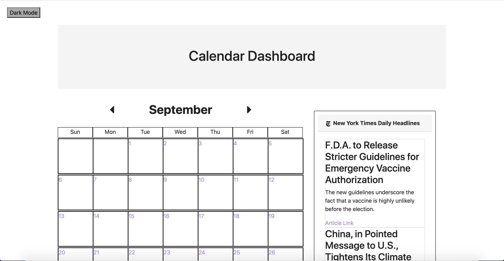
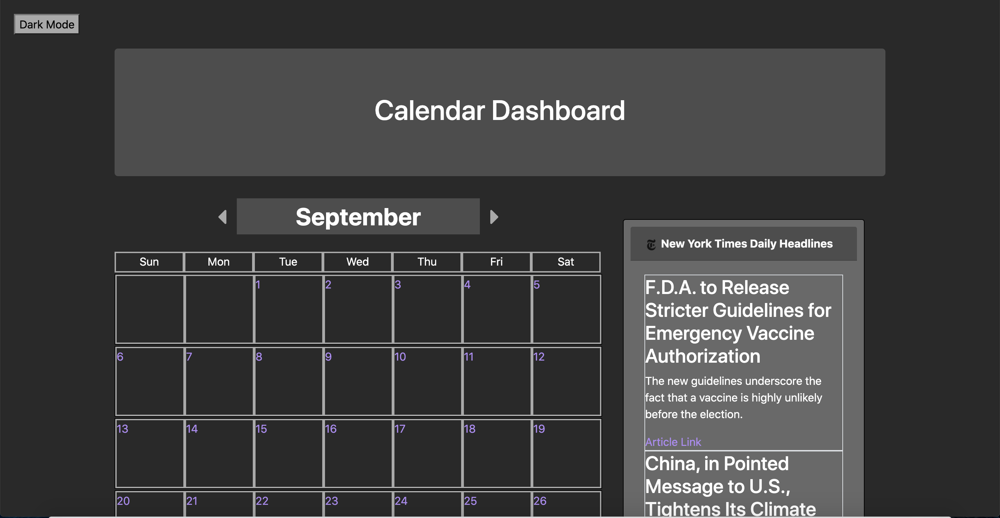

# User Story 

<b>AS a user:</b>

I WANT to be able to enter items/events into the calendar which will then be saved onto the local storage on my device and compose a to do list.

I WANT to be able to view the daily news headlines, in addition to the daily weather

SO THAT I can keep track of my availability and upcoming events as well as manage upcoming tasks

<b>Acceptance Criteria:</b>

GIVEN a calendar dashboard with form inputs (one month layout)

WHEN I select a day from the calendar 

THEN I am able to enter an item/event that will be saved onto the local storage

WHEN I need to recall my daily events 

THEN I will click on the day I want to view

WHEN I enter an item on the to do list

THEN it is save to local storage 

WHEN I complete and item on my to do list

THEN I can check it off my list to show that it has been completed

<b>API's:</b>

USED New York Times API to display daily headlines

USED Weather API to showcase daily and weekly weather forecasts

<b>Images:</b>

<b>Links:</b>

GitHub: https://github.com/M-Source21/project1-calendar 

Live Link: https://m-source21.github.io/project1-calendar/

Presentation Doc: https://docs.google.com/document/d/1f4Vr6Lih51AcUtKgMwzsrXJSHGu39eVaZITDPahGtv0/edit?usp=sharing

Presentation Slides: https://docs.google.com/presentation/d/1k1pYqBEgZzG3R9egRmJj0NLMA0iFigoYf_XVSlgDn2s/edit?usp=sharing